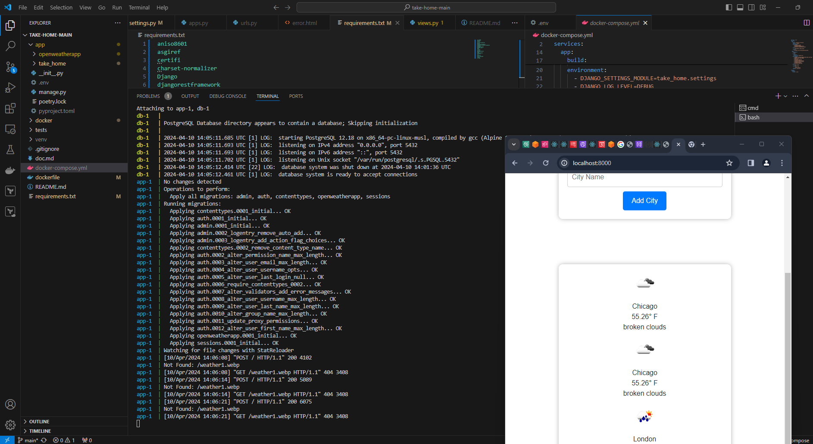

# Django Skeleton

## Getting Started
Dependencies:
* Docker - See [Get Docker](https://docs.docker.com/get-docker/)
* Docker Compose - Installed with Docker Desktop, See [Install Docker Compose](https://docs.docker.com/compose/install/)

With the dependencies installed, running the project is as simple as running:
```bash
docker compose up
```

This will pull the required Docker images and spin up a container running your service on http://localhost:8000.

To end the service, press `Ctrl+C`

## The Activity
Build a simple API in Python, using Django or Flask. This API should integrate with a third party service or a database and accomplish something interesting, but also shouldn’t take terribly long to implement - endpoints for one or two resources would be sufficient. This activity shouldn’t take more than an hour or so. If this doesn’t seem like much time - you’re right! We expect that you’ll have to focus on one of a few areas for your API:
* The API design and interface (REST vs. GraphQL)
* Integration with a third-party API OR Integration with a database

### Requirements
1. A clear problem statement - what do you intend the API to accomplish?
2. Dependencies for running the API
3. A code repository link from which your interview can checkout the code OR a .zip file containing the source code
4. A README file in the code root containing instructions for running the API

### Some Ideas...
#### Interesting APIs
* [NASA Open APIs](https://api.nasa.gov/index.html)
* [OpenWeather API](https://openweathermap.org/api)
* [Polygon.io Stocks API](https://polygon.io/)

Plus anything more you can discover
#### Databases
* [SQLite](https://www.sqlite.org/index.html)
* [PostgreSQL](https://www.postgresql.org/)
* [MySQL](https://www.mysql.com/)
* [MariaDB](https://mariadb.org/)

PostgreSQL is provided in our skeleton projects, but another database is fine if you’d prefer.
#### Projects
* A stock recommendation service
* A green/red alert for outdoor activity safety
* A Mars Rover camera viewer


# Weather API Application


## django
Django is a free and open-source, Python-based web framework that runs on a web server. It follows the model–template–views architectural pattern. It is maintained by the Django Software Foundation, an independent organization established in the US as a 501 non-profit.


## Django Web Architecture
Make sure you have the following prerequisites installed on your Windows machine or ubuntu server to follow the instructions:


Python 3.6 or higher (download)
virtualenv
Docker
We will use the built-in Command Prompt (CMD) for this tutorial. You can search for CMD to open it using Windows search.

Step 1: Create a virtual environment to hold all pip libraries installations

If you don’t have virtualenv installed, you can install it by running the following command in your CMD after Python was installed:

virtualenv venv
Step 2 : Activate the environment:

source ./venv/bin/activate
source ./venv/bin/deactivate ( To Deactivate )

For Windows

source ./venv/Scripts/activate
source ./venv/Scripts/deactivate ( To Deactivate )
Step 3: Create project folder

mkdir my-project
Step 4: Install Django

pip install django
Step 5: Create a new Django project inside the project folder

A Django app is a self-contained component of a Django project. It is a module that provides specific functionality, such as handling authentication, managing blog posts, or serving an API. An app should represent a single, specific functionality or purpose within the overall website.

django-admin startproject my-project
Step 6: Create a new test app:

within the django project using the following command:

python manage.py startapp openweatherapp
***Adding a new app into the project***

python manage.py startapp openweatherapp

Step 7 : Execute ORM Data Migrations:

python manage.py makemigrations

python manage.py migrate

# Database Migration ( PostgreSQL )


Step 8 : Launch the django development server

python manage.py runserver


# Rest


# GraphQL


## graphql mutation operations


http://127.0.0.1:8000/graphql#query=%23%20Welcome%20to%20GraphiQL%0A%23%0A%23%20GraphiQL%20is%20an%20in-browser%20tool%20for%20writing%2C%20validating%2C%20and%0A%23%20testing%20GraphQL%20queries.%0A%23%0A%23%20Type%20queries%20into%20this%20side%20of%20the%20screen%2C%20and%20you%20will%20see%20intelligent%0A%23%20typeaheads%20aware%20of%20the%20current%20GraphQL%20type%20schema%20and%20live%20syntax%20and%0A%23%20validation%20errors%20highlighted%20within%20the%20text.%0A%23%0A%23%20GraphQL%20queries%20typically%20start%20with%20a%20%22%7B%22%20character.%20Lines%20that%20start%0A%23%20with%20a%20%23%20are%20ignored.%0A%23%0A%23%20An%20example%20GraphQL%20query%20might%20look%20like%3A%0A%23%0A%23%20%20%20%20%20%7B%0A%23%20%20%20%20%20%20%20field(arg%3A%20%22value%22)%20%7B%0A%23%20%20%20%20%20%20%20%20%20subField%0A%23%20%20%20%20%20%20%20%7D%0A%23%20%20%20%20%20%7D%0A%23%0A%23%20Keyboard%20shortcuts%3A%0A%23%0A%23%20%20%20Prettify%20query%3A%20%20Shift-Ctrl-P%20(or%20press%20the%20prettify%20button)%0A%23%0A%23%20%20Merge%20fragments%3A%20%20Shift-Ctrl-M%20(or%20press%20the%20merge%20button)%0A%23%0A%23%20%20%20%20%20%20%20%20Run%20Query%3A%20%20Ctrl-Enter%20(or%20press%20the%20play%20button)%0A%23%0A%23%20%20%20%20Auto%20Complete%3A%20%20Ctrl-Space%20(or%20just%20start%20typing)%0Aquery%20%7B%0A%20%20Cities%7B%0A%20%20%20%20id%0A%20%20%20%20name%0A%20%20%20%0A%20%20%7D%0A%7D%0A%0A


query {
  Cities{
    id
    name
   
  }
}



